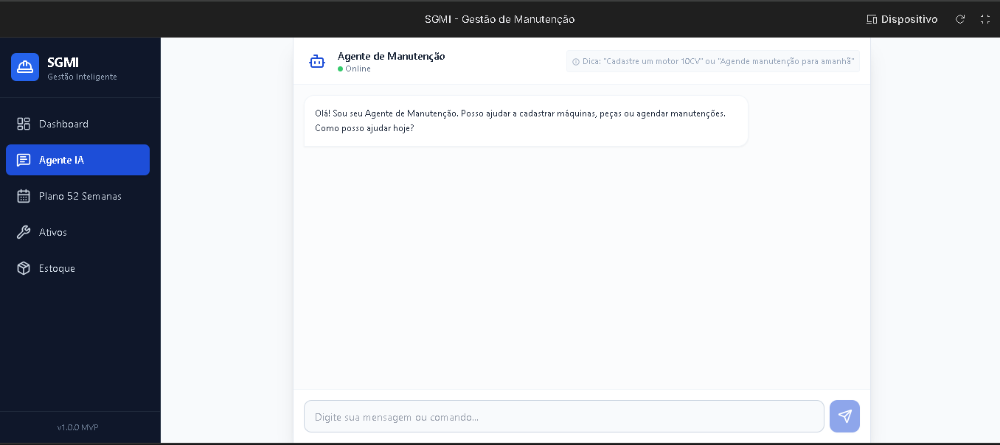
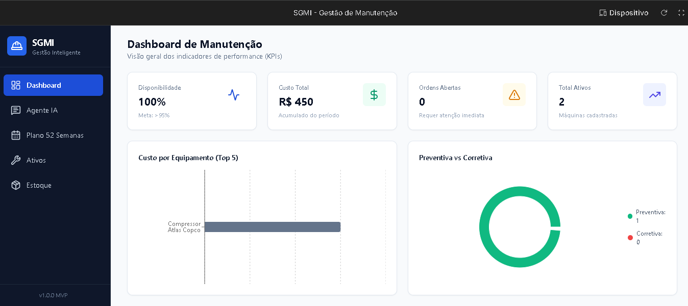
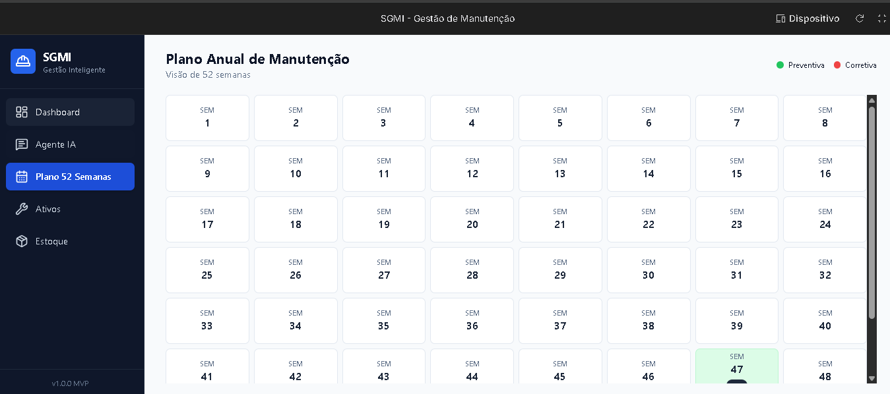
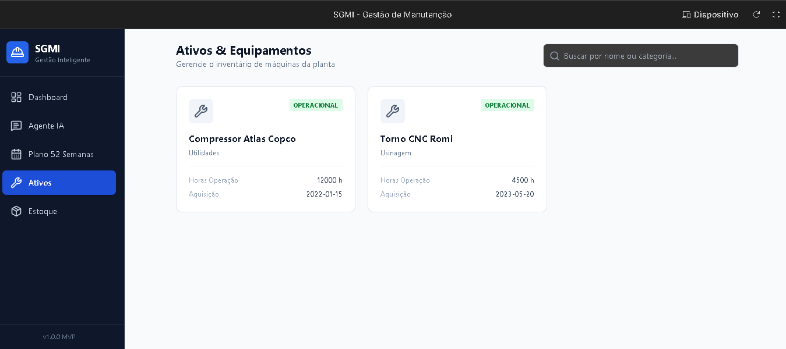
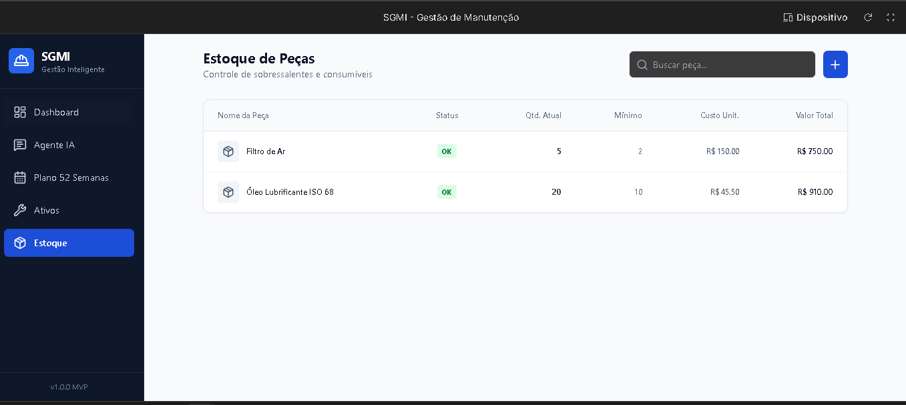

# 📄 PRD – SGMI (Sistema de Gestão de Manutenção Industrial)

## 1. Visão Geral
- **Nome do Produto:** SGMI – Sistema de Gestão de Manutenção Industrial  
- **Descrição:** Aplicativo de gestão de manutenção industrial baseado em linguagem natural (chat-first), eliminando formulários complexos e planilhas.  
- **Objetivo:** Simplificar e automatizar a gestão de manutenção em pequenas e médias indústrias, com foco em engajamento, controle de custos e estoque de peças.  

---

## 2. Contexto e Problema
- **Problemas atuais:**
  - Entrada manual excessiva em sistemas tradicionais.
  - Pouca personalização e baixa usabilidade.
  - Falta de controle integrado de peças e sobressalentes.
  - Gestores desistem de acompanhar indicadores e custos.  

- **Solução proposta:**
  - Interface conversacional via chat (Agente de Manutenção).
  - Recomendações automáticas de manutenção preventiva.
  - Relatórios simples e personalizados.
  - Gestão integrada de estoque de peças.
  - Plano anual de manutenção (52 semanas).
  - Geração automática de Ordens de Serviço (OS).

---

## 3. Público-Alvo
- Pequenas e médias indústrias sem familiaridade com sistemas complexos.  
- Gestores que desejam iniciar a organização da manutenção de forma prática.  
- Empresas que precisam controlar custos, disponibilidade de ativos e estoque de peças sem burocracia.  

---

## 4. Funcionalidades-Chave
- Cadastro de ativos e máquinas/equipamentos **sem restrições** via chat (NLP).  
- Classificação automática das manutenções (preventiva/corretiva).  
- Definição e acompanhamento de manutenções preventivas e corretivas.  
- **Plano anual de manutenção (52 semanas)** com recomendações automáticas.  
- **Geração de Ordem de Serviço (OS)** com dados de:  
  - Equipamento, tipo de serviço, data/hora início/fim, tempo total, pessoas alocadas, HH, custos.  
- Relatórios simples e personalizados.  
- Alertas de orçamento mensal excedido.  
- Dashboard de manutenção com indicadores (MTBF, disponibilidade, custos, falhas, etc.).  
- Gestão de estoque de peças com cadastro, controle de entrada/saída, alertas de estoque mínimo e relatórios de consumo.  

---

## 5. MVP (Produto Mínimo Viável)
- **Telas principais:**
  - Chat (Agente de Manutenção).  
  - Metas e alertas.  
  - Relatórios simples.  
  - Estoque de peças (cadastro e alertas).  
- **Recursos técnicos:**
  - NLP para cadastro e consultas.  
  - Motor de categorização automática.  
  - Sistema de notificações.  
  - Persistência local (simulação de backend).  

---

## 6. Requisitos Funcionais
- **RF01:** Usuário deve poder cadastrar qualquer ativo/máquina/equipamento via chat.  
- **RF02:** Sistema deve classificar automaticamente manutenções como corretivas ou preventivas.  
- **RF03:** Usuário deve receber alertas quando orçamento mensal for ultrapassado.  
- **RF04:** Sistema deve gerar relatórios simples e personalizados.  
- **RF05:** Dashboard deve apresentar indicadores de manutenção (MTBF, disponibilidade, custos, etc.).  
- **RF06:** Usuário deve poder consultar histórico de manutenções por equipamento.  
- **RF07:** Usuário deve poder cadastrar peças sobressalentes via chat.  
- **RF08:** Sistema deve controlar entrada e saída de peças.  
- **RF09:** Sistema deve emitir alertas de estoque mínimo.  
- **RF10:** Relatórios devem incluir consumo de peças e custos associados.  
- **RF11:** Sistema deve permitir criação de plano anual de manutenção (52 semanas).  
- **RF12:** Sistema deve gerar Ordens de Serviço (OS) automaticamente a partir do plano.  

---

## 7. Requisitos Não Funcionais
- **Usabilidade:** Interface conversacional intuitiva.  
- **Performance:** Respostas rápidas no chat (<2s).  
- **Escalabilidade:** Suporte a múltiplos ativos, peças e usuários simultâneos.  
- **Segurança:** Controle de acesso e proteção de dados.  
- **Integração:** Compatibilidade com sistemas de manutenção existentes.  

---

## 8. Métricas de Sucesso
- Engajamento: nº de interações no chat por usuário/mês.  
- Retenção: % de usuários ativos após 3 meses.  
- Clareza: avaliação positiva (>80%) dos relatórios.  
- Eficiência: redução de tempo gasto em registros manuais (>50%).  
- Controle de estoque: redução de falhas por falta de peças (>30%).  

---

## 9. Roadmap Inicial
- **Fase 1 (MVP):** Chat, alertas, relatórios simples, cadastro básico de peças.  
- **Fase 2:** Dashboard completo com indicadores e estoque integrado.  
- **Fase 3:** Plano anual de manutenção (52 semanas) + geração de OS.  
- **Fase 4:** Integração com sistemas externos e previsão de consumo de peças.  
- **Fase 5:** Relatórios avançados e predição de falhas.  

---

## 10. Riscos e Mitigações
- **Baixa adoção:** UX simples e onboarding guiado.  
- **Resistência cultural:** Relatórios claros e foco em resultados financeiros.  
- **Limitações técnicas de NLP:** Treinamento contínuo do modelo.  
- **Gestão de estoque pouco utilizada:** Alertas automáticos e relatórios de consumo.  

---

# 🖼️ Telas do Sistema SGMI

## 1. Chat com Agente de Manutenção
- Interface conversacional para cadastro de máquinas, peças e agendamento de manutenções.
- Mensagem inicial: “Olá! Sou seu Agente de Manutenção. Como posso ajudar hoje?”
 

## 2. Dashboard de Indicadores
- Visão geral de performance: disponibilidade, custo total, ordens fechadas, ativos.
- Gráficos: custo por equipamento (Top 5), preventiva vs corretiva.

 

## 3. Plano Anual de Manutenção (52 Semanas)
- Grade com 52 semanas (SEM 1 a SEM 52).
- Marcação visual por tipo de manutenção (verde = corretiva, vermelho = preventiva).

 

## 4. Cadastro de Ativos & Equipamentos
- Exibição de equipamentos com dados: nome, localização, horas de operação, data de aquisição, status.

 

## 5. Estoque de Peças
- Tabela com nome da peça, quantidade atual, mínimo, custo unitário e total.
- Alertas de estoque mínimo e botão para adicionar novas peças.

 

---

Este Agente foi desenvolvido pelo **GOOLE AI Studio**

## 📄 Licença

Este projeto está sob licença MIT.  
Consulte o arquivo `LICENSE`.